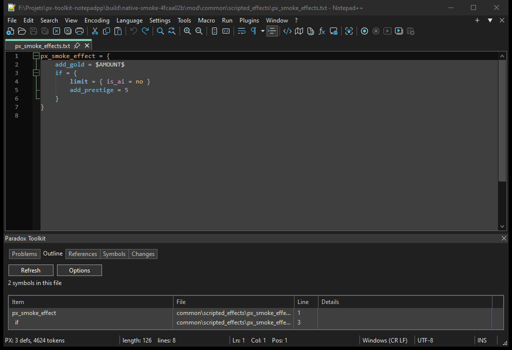
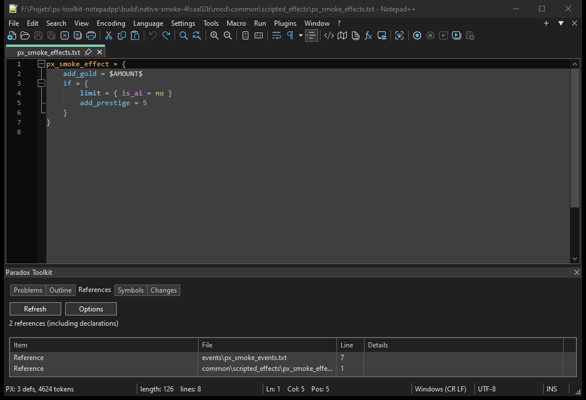
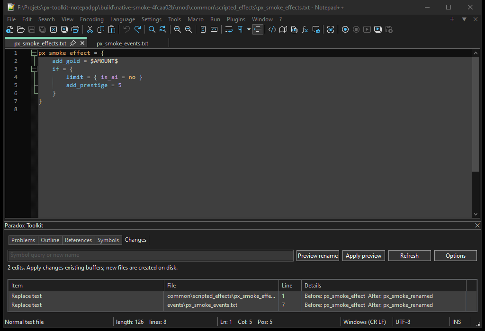
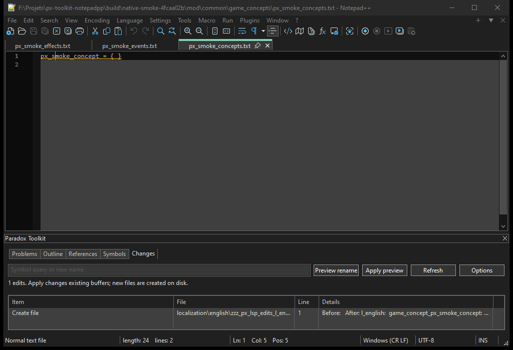
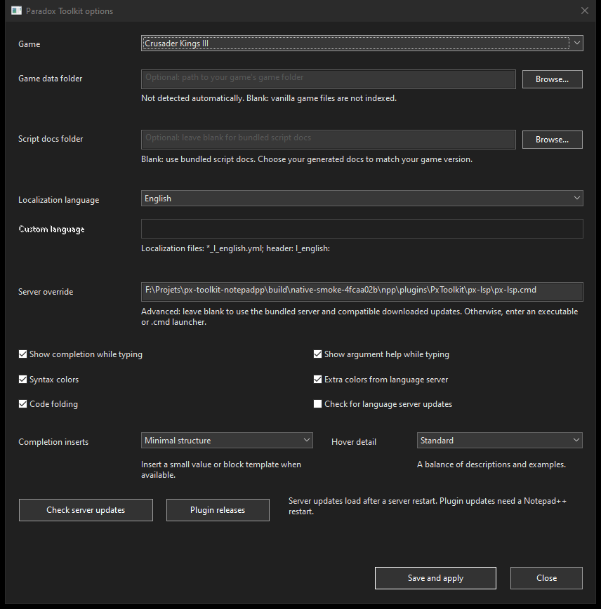

# Editor screenshots

These captures show the unreleased Paradox Modding Toolkit plugin 0.2.1 build with px-lsp 0.3.4 in Notepad++ 8.9.8 (Windows x64, dark mode). The scripts belong to the repository's synthetic CK3 test mod. No game installation is needed for these examples.

## Outline and highlighting

The outline lists the scripted effect and its nested `if` block. The editor shows syntax colors and fold controls beside the script.

## Cross-file references

Find references lists both the effect's definition and its use in an event. Open a result to jump to that location.

## Rename preview

The Changes tab shows the old and new names in both files. The buffers remain unchanged until **Apply preview** is selected.

## Localization quick fix

A missing game-concept localization key has a quick fix. Its preview shows the localization file that will be created before the change is applied.

## Options

Choose the game, documentation folders, localization language, completion behavior and editor features in the options window. The server override shown here points to the isolated test server.

## Refresh the captures

From the repository root, run `test/native-smoke.ps1 -Dark` after preparing the package and portable editor as described in [Contributing](../../CONTRIBUTING.md#test-editor-changes). The runner writes images and test results into a new `build/native-smoke-*` directory. Check that `done.txt` reports `0 failures`, inspect each image, then copy the five matching PNG files into this directory. Update the version information above and in the [main README](../../README.md#screenshots) when the capture environment changes.
